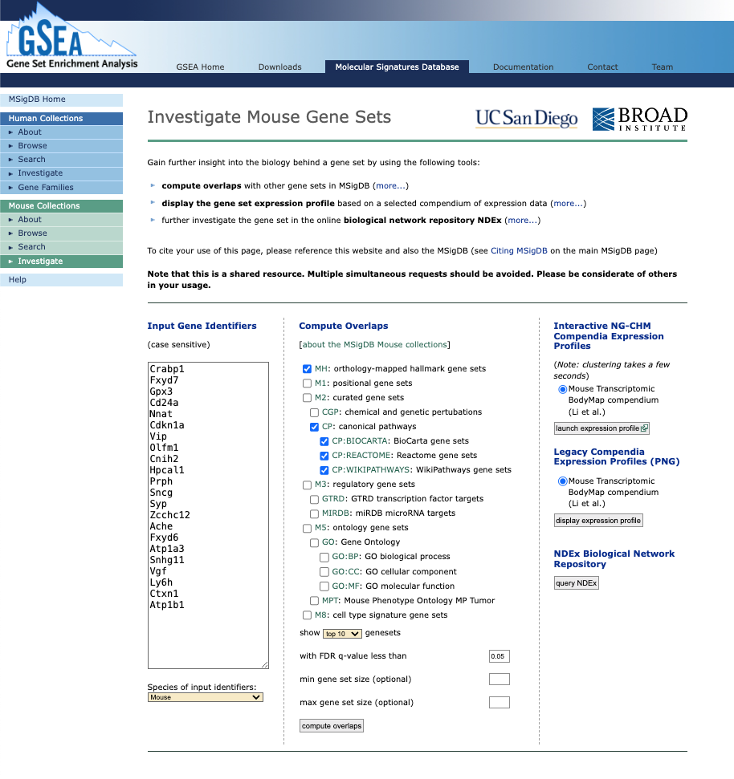
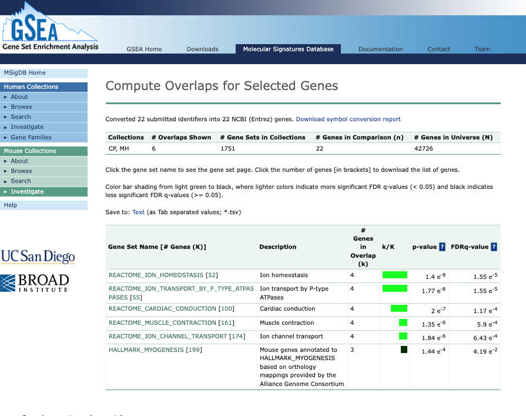
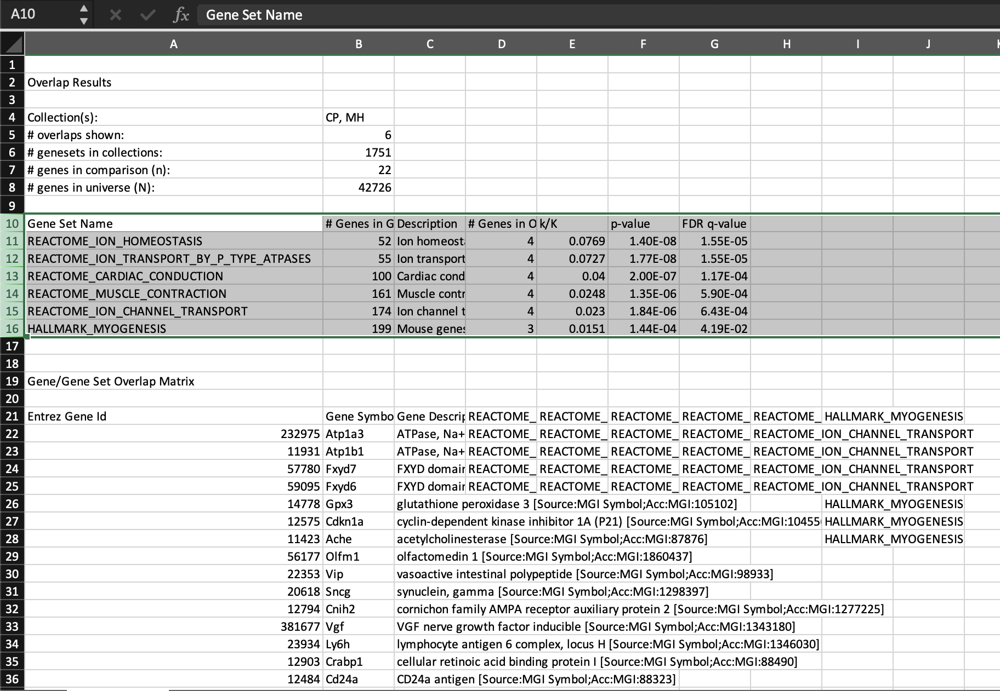
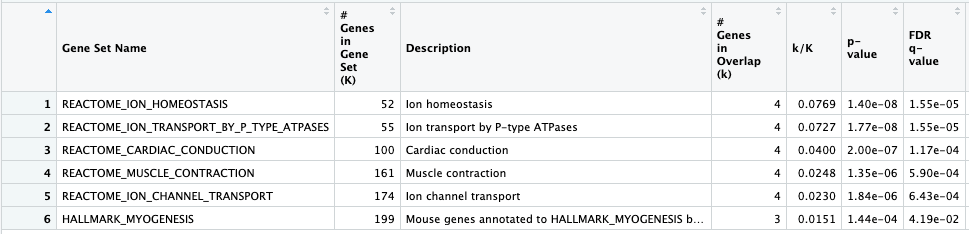
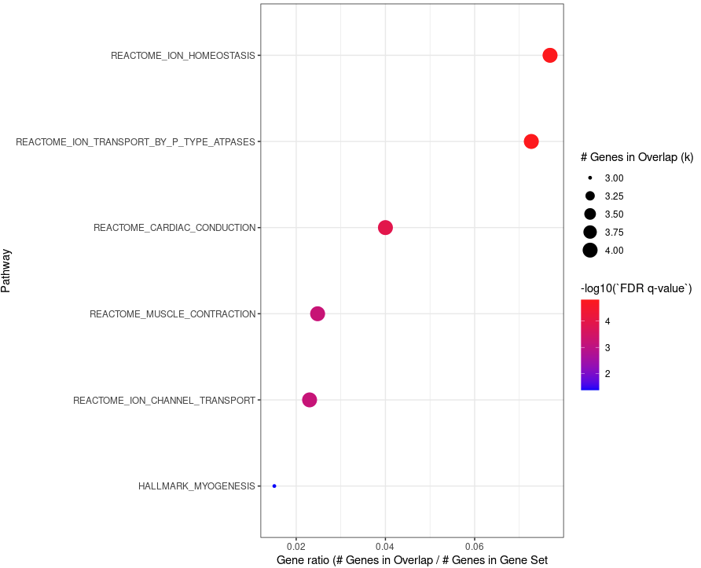

# MSigDB Overlap Analysis Dot Plots

This is an outline of how the MSigDB Overlap Analysis can be run and how to make a dot plot of the results.

These methods were written on 1/9/24.

1. Make lists of genes up, down, or up and down.
2. Go to [MSigDB Investigate Mouse Gene Sets](https://www.gsea-msigdb.org/gsea/msigdb/mouse/annotate.jsp).
    
    link: [https://www.gsea-msigdb.org/gsea/msigdb/mouse/annotate.jsp](https://www.gsea-msigdb.org/gsea/msigdb/mouse/annotate.jsp)
    
3. Enter list of genes into the “Input Gene Identifiers” field.
    
    
    
4. Under “Compute Overlaps”, select which MSigDB Mouse collections to compute overlaps for.
    1. For this analysis, I chose:
        - “MH: orthology-mapped hallmark gene sets”
        - From M2: curated gene sets, only ”CP: canonical pathways”
        
        
        
5. Download the results as a .tsv file
    
    
    
6. From the file, select the portion of the table with the overlap results.
    
    
    
7. Load data table into R.
    
    
    

1. Use `ggplot` to make a dot plot of the pathways.
    
    ```{r}
    genes_all = read_tsv("MSigDB_overlap_table.tsv") %>% mutate(`Gene Set Name` = fct_reorder(`Gene Set Name`, `k/K`))
    
    ggplot(genes_all, aes(x = `k/K`, y = `Gene Set Name`, color = -log10(`FDR q-value`), size = `# Genes in Overlap (k)`)) +
      geom_point(stat = 'identity') + 
      xlab("Gene ratio (# Genes in Overlap / # Genes in Gene Set") + ylab("Pathway") + ggtitle("MSigDB Overlap Analysis") + 
      theme_bw() +
      scale_color_gradient(low = "blue", high = "red")
    ```
    
    
